# spring8_distribution

Distribution version for stitching, center of rotation correction, and reconstruction of projections captured at SPring-8 in December 2025.

## 環境構築

- Visual Studio Code
- MSVC(Visual StudioのC/C++用コンパイラ)
- CMake
- HDF5
- CUDA Toolkit

### Visual Studio Code

- インストールしてなかったら[こちらから](https://code.visualstudio.com/).
- 以下の拡張機能をインストール.
  - C/C++ Extension Pack  
    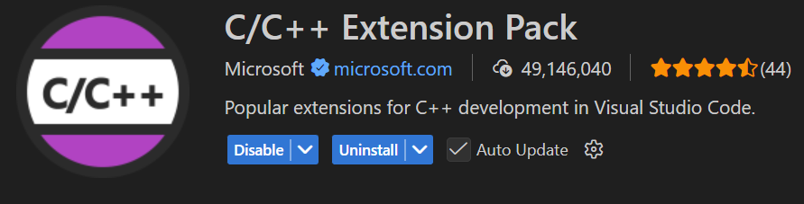

### MSVCのインストール

- Visual Studio がインストール済みなら多分入っている(以下確認手順).
  - Visual Studio Installerを開く  
    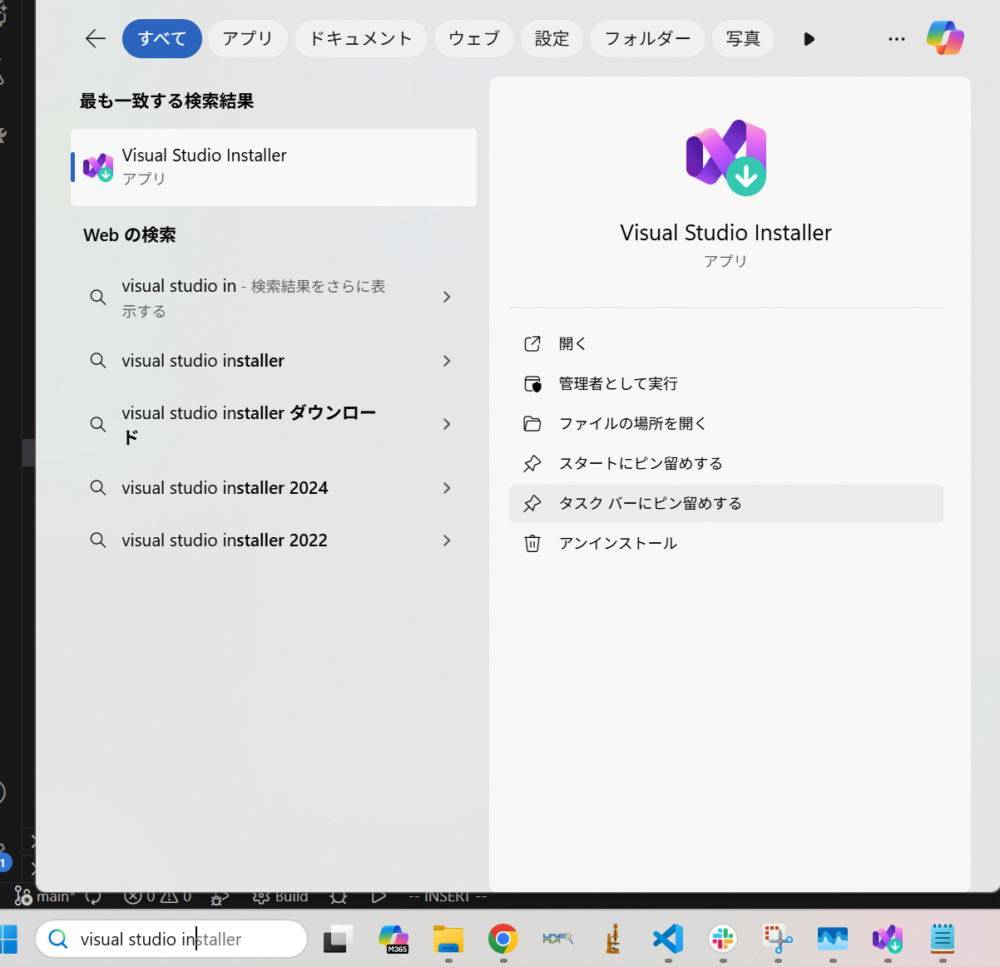  

  - 変更をクリック  
    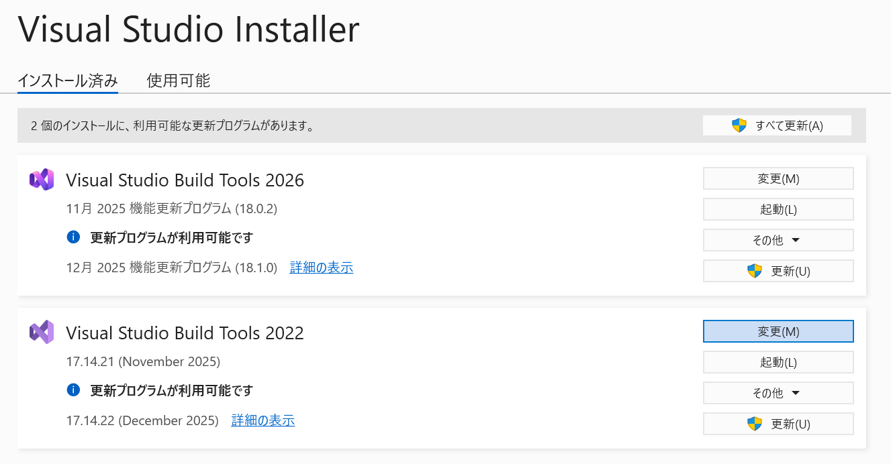  

  - C++によるデスクトップ開発&rarr;VS **2022**のMSVCにチェックついてたら入ってる. ついてなかったら, チェック入れてインストール(2026ではダメ).  
    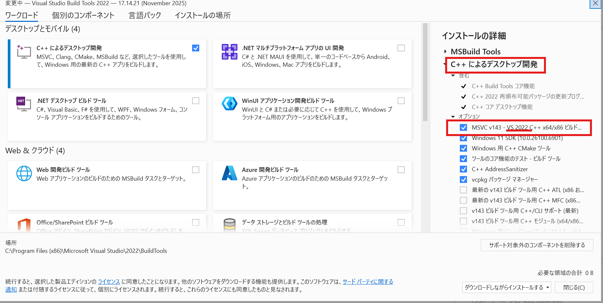  

- Visual Studio が入ってない場合は[こちらから](https://visualstudio.microsoft.com/ja/vs/older-downloads/) Build Tools for Visual Studio 2022 を入れるとよい. そのときもインストールする際に上記のツールを選択すればよい.

### CMakeのインストール

- [こちらから](https://cmake.org/download/)最新版を入れておけば問題ない
  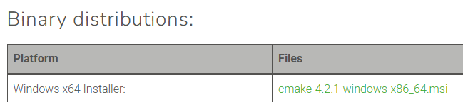  

(すでに入っている場合も3.31以降なら確実に動くはず)
- install options では <u>Add CMake to the system PATH for (好きなほう)</u> を選択

### HDF5のインストール

- [こちらから](https://github.com/HDFGroup/hdf5/releases/tag/2.0.0) hdf5-x.x.x-win-vs2022_cl.msiをダウンロードして実行  
  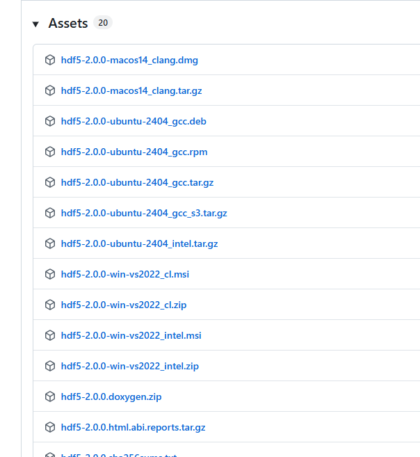  

- 忘れたけど, PATHを追加できそうな設定があったらする.なかったら, インストール先のbinを環境変数のPATHに追加(自分の場合は、下の画像のところ). **インストール先はこの後の設定で必要になるので、確認しておくこと.**  
  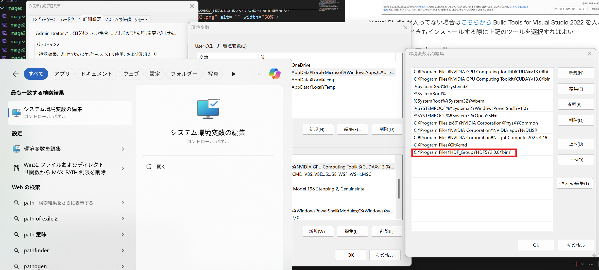  

- VS CodeでCMAKE_PREFIX_PATHの設定
  - VS Codeを開いて`ctrl + ,`でSettingsを開いて, 下の画像の黄矢印部をクリックして settings.jsonを開く.  
    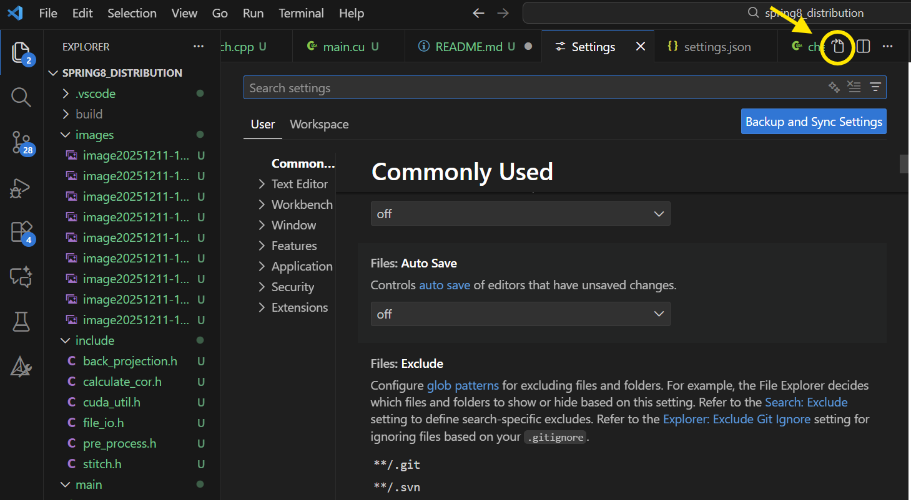  

  - settings.jsonに以下を追加(2.0.0なら同じはず).
    ```settings.json
    "cmake.configureSettings": {
        "CMAKE_PREFIX_PATH": [
            "(インストール先)\\HDF_Group\\HDF5\\2.0.0\\cmake"
        ]
    },
    ```
    他の設定もあると思うので, 自分のsettings.jsonは以下のような感じ.
    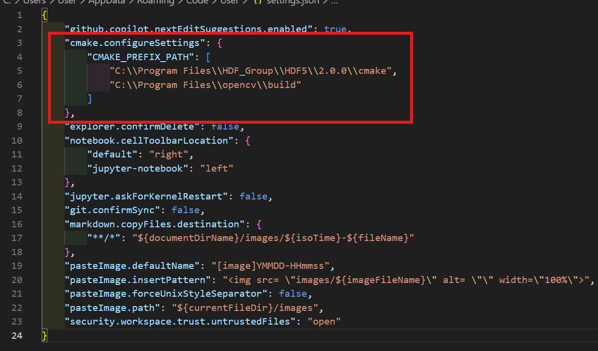  

### CUDA Toolkitのインストール

- 自分のパソコンのGPUを調べる(タスクマネージャー開いたらわかる).
  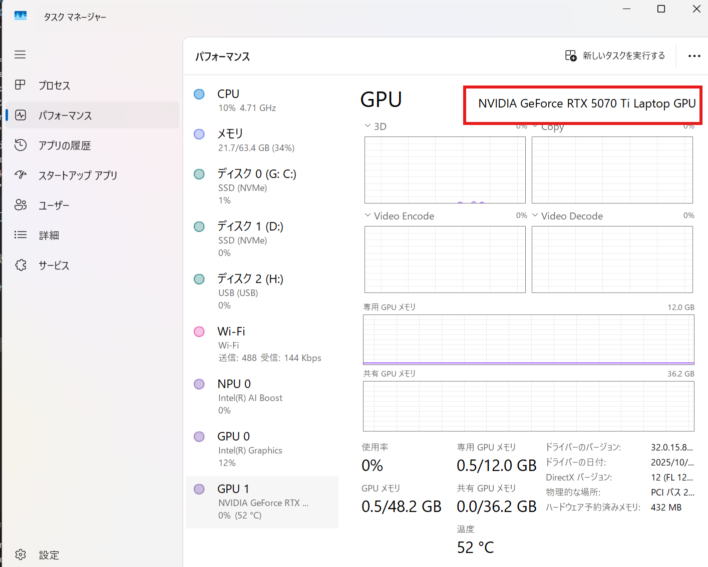  

- [こちらから](https://www.nvidia.com/ja-jp/drivers/)対応するドライバをインストール  
  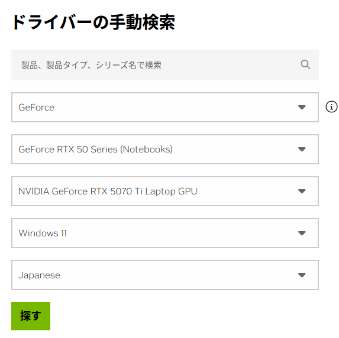  

    - Game Ready, StudioはどっちでもOK. そのまま進めてダウンロード
- [こちらから](https://developer.nvidia.com/cuda/toolkit) CUDA Toolkitをインストール
  - 環境に合わせて選択してDownload  
    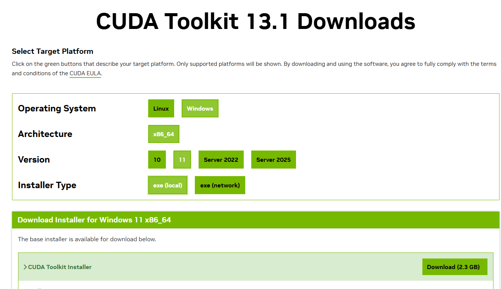  

  - ダウンロードできたら, 開いてデフォルト設定のままインストール.

## 使い方

- 直接ダウンロードする. もしくは, cloneする([こちらから](https://git-scm.com/install/windows)Gitのインストールが必要).
  - ダウンロードする場合.下の画像の通りzipをダウンロードして解凍したフォルダをVs Codeで `File` &rarr; `Open Folder`で開く
    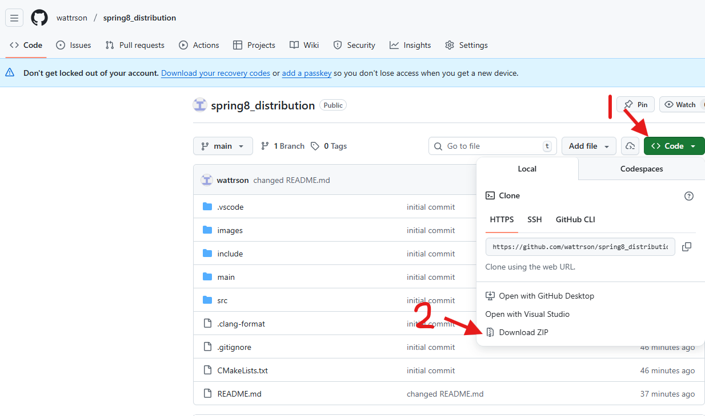  
  - cloneする場合.
    - コードを置くディレクトリ(フォルダ)を作って, VS Codeで`File` &rarr; `Open Folder`で開く
    - ターミナルを開いて(`Terminal` &rarr;`New Terminal` or `ctrl + shift + @`)次のコマンドを実行.  
    `git clone https://github.com/wattrson/spring8_distribution.git`
- CMake Tools での設定  
  上から設定すればよい.  
  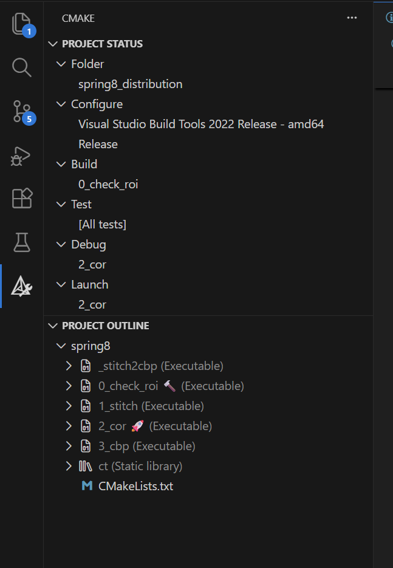  
  - Folderは開いたフォルダになってると思う. 違ったら`CMakeLists.txt`が置いてあるフォルダに変更.
  - ConfigureはkitをRelease-amd64みたいなの(x86がついてない方)を選んで、build variantはReleaseに
- `0_check_roi`&rarr;`1_stitch`&rarr;`2_cor`&rarr;`3_cbp`の順で実行すればよい.`_stitch2cbp`は1~3をまとめてやってくれるやつ.
  - 実行はmainディレクトリに対応するファイル(ex. `main/0_check_roi.cu`)があるので、それの中身の赤線で挟まれたところだけ修正して, BuildしてLaunch.  
    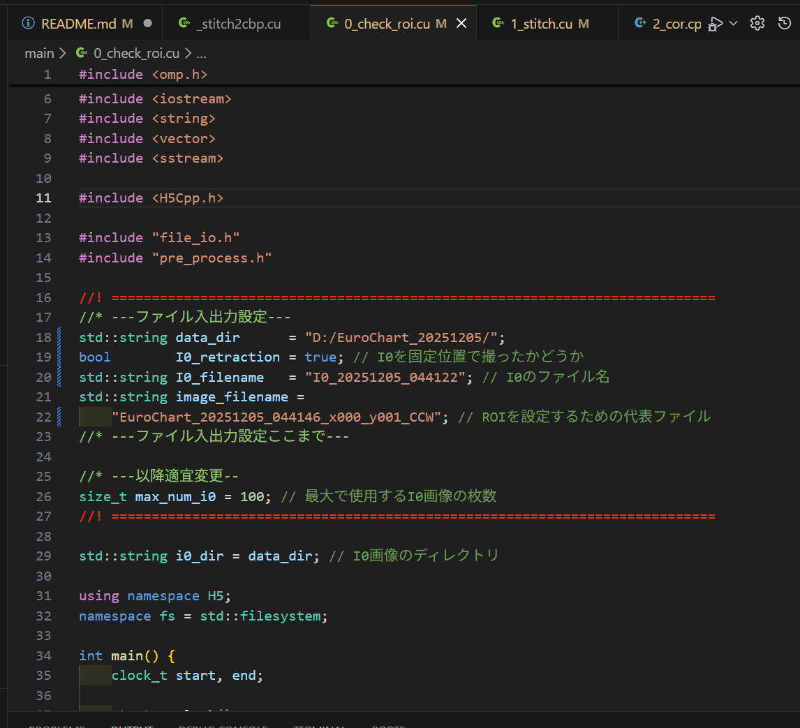  

### 0_check_roi

- ビーム強度がほとんどない部分をカットしてからスティッチしないと, 下の画像のように, 明暗の縞ができるため, どれくらいカットするかをI0で補正した画像を見ながら決めるためのもの(現状手入力).  
  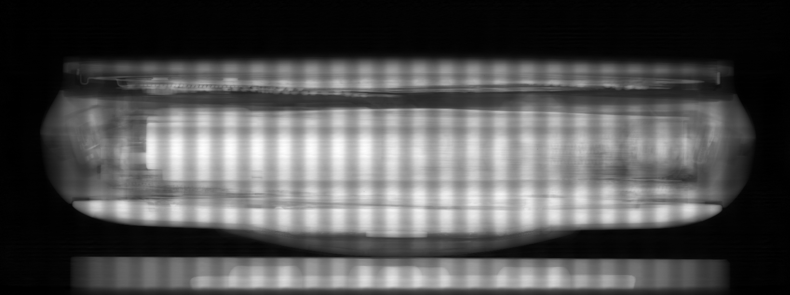  
- 出力に`corrected_image_`から始まるrawファイルがあるので, それをImageJで開いてちゃんと使えそうな部分を矩形で囲んで, そのときの`x,y,w,h`の値を`1_stitch.cu`もしくは`_stitch2cbp.cu`の`ROI_X,Y,WIDTH,HEIGHT`に入力する. ImageJでの矩形は方向キー(&larr;&darr;&uarr;&rarr;)で平行移動できて, `alt + 方向キー`でサイズも変更できる. <u>`x,y,w,h`の値が消えてしまったときに再表示させるのにも便利.</u>
  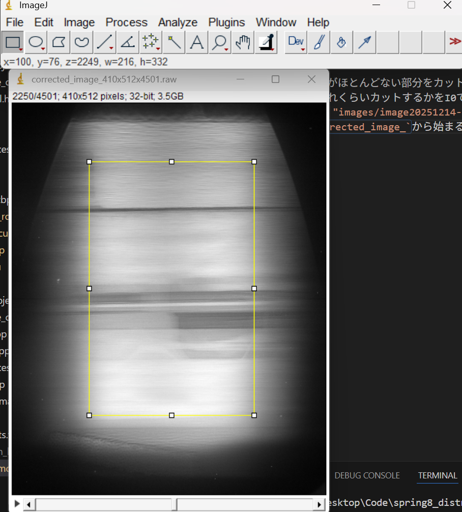  